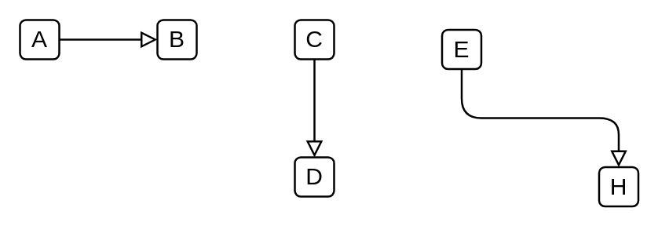

# Specialization

## Definition

```
{
  _style: { 
    dependency: 'endArrow=block;html=1;endFill=0;edgeStyle=elbowEdgeStyle;elbow=vertical;',
  },
}
```

## Usage

```
import { Specialization } from '@diac/standard-components-diagrams/archimate3Relationships'

<Specialization/>
```

## Preview


