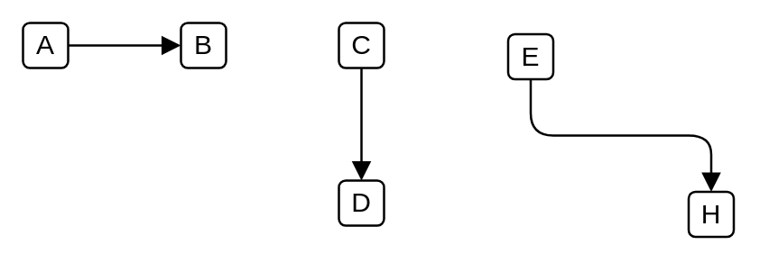

# Triggering

## Definition

```
{
  _style: { 
    dependency: 'edgeStyle=elbowEdgeStyle;html=1;endArrow=block;dashed=0;elbow=vertical;endFill=1;',
  },
}
```

## Usage

```
import { Triggering } from '@dinghy/standard-components-diagrams/archimate3Relationships'

<Triggering/>
```

## Preview


