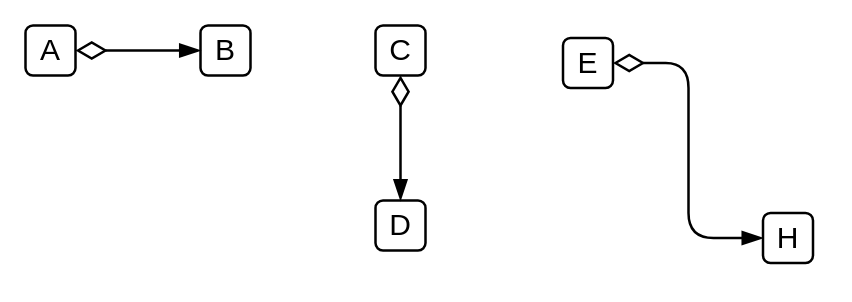

# Conditional Sequence Flow

## Definition

```
{
  _style: { 
    dependency: 'edgeStyle=elbowEdgeStyle;fontSize=12;html=1;endArrow=blockThin;endFill=1;startArrow=diamondThin;startFill=0;endSize=6;startSize=10;',
  },
}
```

## Usage

```
import { ConditionalSequenceFlow } from '@reactiac/standard-components-diagrams/bpmn2General'

<ConditionalSequenceFlow/>
```

## Preview


