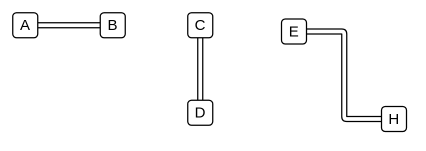

# Conversation Link

## Definition

```
{
  _style: { 
    dependency: 'edgeStyle=elbowEdgeStyle;fontSize=12;html=1;shape=link;',
  },
}
```

## Usage

```
import { ConversationLink } from '@diac/standard-components-diagrams/bpmn2General'

<ConversationLink/>
```

## Preview


