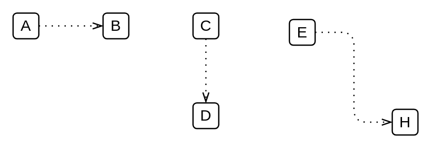

# Directional / Directed Data Association

## Definition

```
{
  _style: { 
    dependency: 'edgeStyle=elbowEdgeStyle;fontSize=12;html=1;endFill=0;startFill=0;endSize=6;startSize=6;dashed=1;dashPattern=1 4;endArrow=openThin;startArrow=none;',
  },
}
```

## Usage

```
import { DirectionalDirectedDataAssociation } from '@dinghy/standard-components-diagrams/bpmn2General'

<DirectionalDirectedDataAssociation/>
```

## Preview


