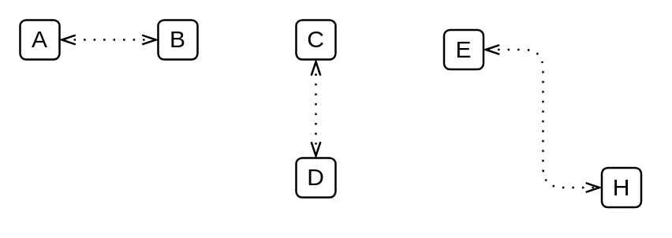

# BPMN 2.0 General Dependencies

- [Association](./association.md)  

- [BiDirectionalAssociation](./bi-directional-association.md)  

- [ConditionalSequenceFlow](./conditional-sequence-flow.md)  

- [ConversationLink](./conversation-link.md)  

- [DefaultSequenceFlow](./default-sequence-flow.md)  

- [DirectionalDirectedDataAssociation](./directional-directed-data-association.md)  

- [MessageFlow](./message-flow.md)  

- [SequenceFlow](./sequence-flow.md)  

