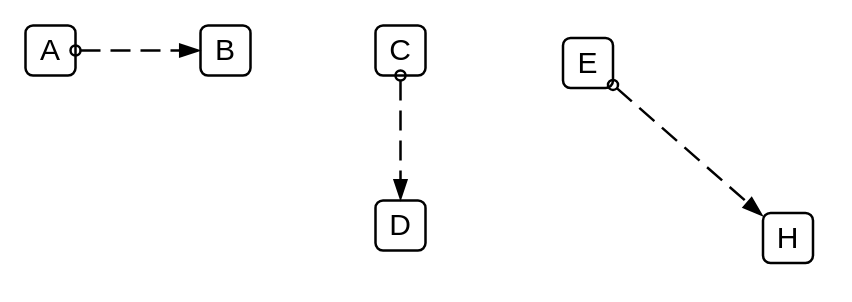

# Message Flow

## Definition

```
{
  _style: { 
    dependency: 'dashed=1;dashPattern=8 4;endArrow=blockThin;endFill=1;startArrow=oval;startFill=0;endSize=6;startSize=4;html=1;',
  },
}
```

## Usage

```
import { MessageFlow } from '@reactiac/standard-components-diagrams/bpmn2General'

<MessageFlow/>
```

## Preview


