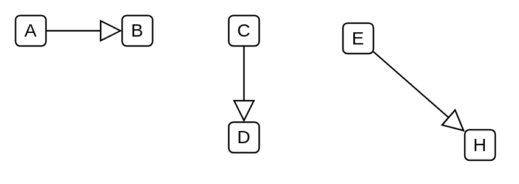

# Generalization

## Definition

```
{
  _style: { 
    dependency: 'edgeStyle=none;html=1;endSize=12;endArrow=block;endFill=0;',
  },
}
```

## Usage

```
import { Generalization } from '@dinghy/standard-components-diagrams/sysmlBlocks'

<Generalization/>
```

## Preview


