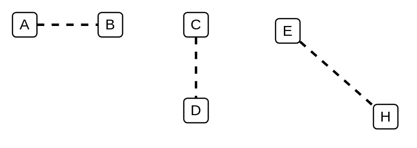

# General Ordering

## Definition

```
{
  _style: { 
    dependency: 'edgeStyle=none;html=1;endArrow=none;verticalAlign=bottom;dashed=1;strokeWidth=2;',
  },
}
```

## Usage

```
import { GeneralOrdering } from '@diac/standard-components-diagrams/sysmlInteractions'

<GeneralOrdering/>
```

## Preview


