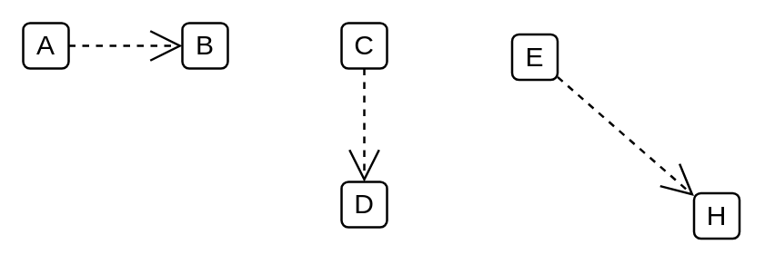

# Conform

## Definition

```
{
  _style: { 
    dependency: 'edgeStyle=none;html=1;endArrow=open;endSize=12;dashed=1;verticalAlign=bottom;',
  },
}
```

## Usage

```
import { Conform } from '@diac/standard-components-diagrams/sysmlModelElements'

<Conform/>
```

## Preview


