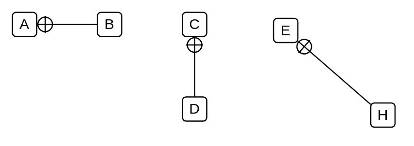

# Package Containment

## Definition

```
{
  _style: { 
    dependency: 'edgeStyle=none;html=1;startArrow=sysMLPackCont;startSize=12;endArrow=none;',
  },
}
```

## Usage

```
import { PackageContainment } from '@reactiac/standard-components-diagrams/sysmlModelElements'

<PackageContainment/>
```

## Preview


