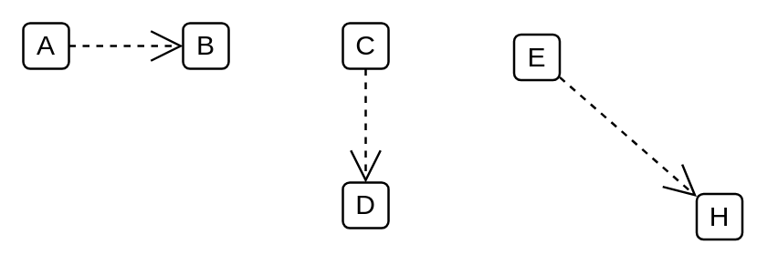

# Metamodel Reference

## Definition

```
{
  _style: { 
    dependency: 'edgeStyle=none;html=1;endArrow=open;endSize=12;dashed=1;verticalAlign=top;',
  },
}
```

## Usage

```
import { MetamodelReference } from '@reactiac/standard-components-diagrams/sysmlProfiles'

<MetamodelReference/>
```

## Preview


