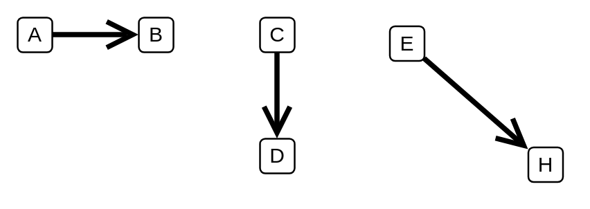

# Transition

## Definition

```
{
  _style: { 
    dependency: 'edgeStyle=none;html=1;endArrow=open;endSize=12;strokeWidth=3;verticalAlign=bottom;',
  },
}
```

## Usage

```
import { Transition } from '@diac/standard-components-diagrams/sysmlStateMachines'

<Transition/>
```

## Preview


