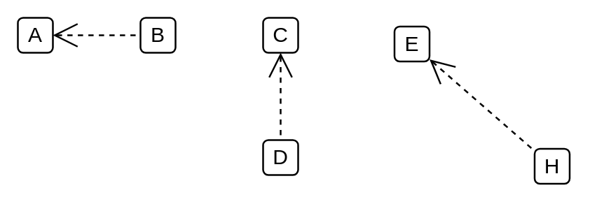

# Extend

## Definition

```
{
  _style: { 
    dependency: 'edgeStyle=none;html=1;startArrow=open;endArrow=none;startSize=12;verticalAlign=bottom;dashed=1;labelBackgroundColor=none;',
  },
}
```

## Usage

```
import { Extend } from '@dinghy/standard-components-diagrams/sysmlUsecases'

<Extend/>
```

## Preview


