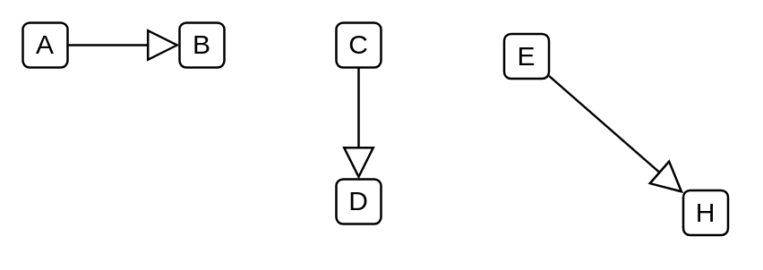

# Generalization

## Definition

```
{
  _style: { 
    dependency: 'edgeStyle=none;html=1;endArrow=block;endFill=0;endSize=12;verticalAlign=bottom;',
  },
}
```

## Usage

```
import { Generalization } from '@diac/standard-components-diagrams/sysmlUsecases'

<Generalization/>
```

## Preview


