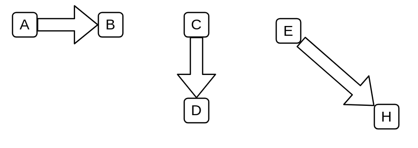

# Shipments

## Definition

```
{
  _style: { 
    dependency: 'shape=flexArrow;html=1;',
  },
}
```

## Usage

```
import { Shipments } from '@reactiac/standard-components-diagrams/valueStreamMapping'

<Shipments/>
```

## Preview


