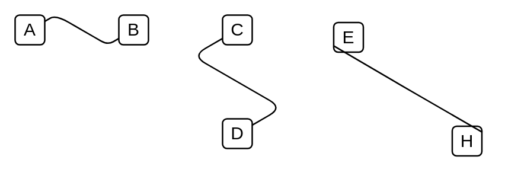

# Isometric Edge 1

## Definition

```
{
  _style: { 
    dependency: 'edgeStyle=isometricEdgeStyle;endArrow=none;html=1;',
  },
}
```

## Usage

```
import { IsometricEdge1 } from '@dinghy/standard-components-diagrams/aws3d'

<IsometricEdge1/>
```

## Preview


