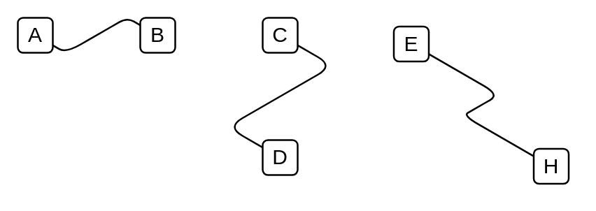

# Isometric Edge 2

## Definition

```
{
  _style: { 
    dependency: 'edgeStyle=isometricEdgeStyle;endArrow=none;html=1;elbow=vertical;',
  },
}
```

## Usage

```
import { IsometricEdge2 } from '@dinghy/standard-components-diagrams/aws3d'

<IsometricEdge2/>
```

## Preview


