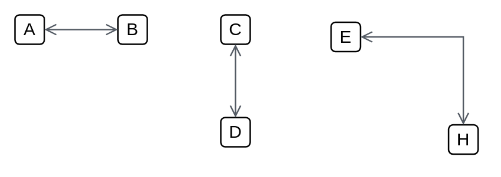

# Open (double)

## Definition

```
{
  _style: { 
    dependency: 'edgeStyle=orthogonalEdgeStyle;htmDepartman barl=1;endArrow=open;elbow=vertical;startArrow=open;startFill=0;endFill=0;strokeColor=#545B64;rounded=0;',
  },
}
```

## Usage

```
import { OpenDouble } from '@reactiac/standard-components-diagrams/awsArrows'

<OpenDouble/>
```

## Preview


