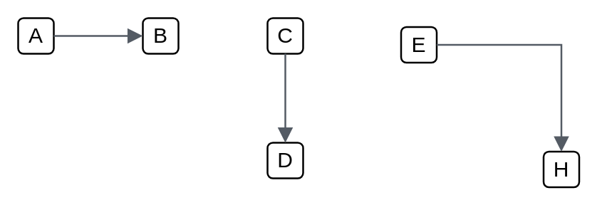

# Default (left) 2

## Definition

```
{
  _style: { 
    dependency: 'edgeStyle=orthogonalEdgeStyle;html=1;endArrow=block;elbow=vertical;startArrow=none;endFill=1;strokeColor=#545B64;rounded=0;',
  },
}
```

## Usage

```
import { DefaultLeft2 } from '@diac/standard-components-diagrams/aws18Arrows'

<DefaultLeft2/>
```

## Preview


