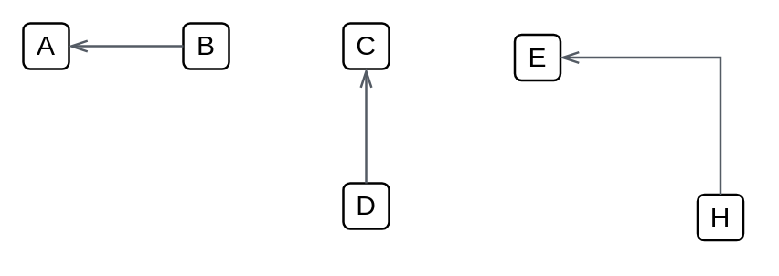

# Open (thin, left)

## Definition

```
{
  _style: { 
    dependency: 'edgeStyle=orthogonalEdgeStyle;html=1;endArrow=none;elbow=vertical;startArrow=openThin;startFill=0;strokeColor=#545B64;rounded=0;',
  },
}
```

## Usage

```
import { OpenThinLeft } from '@reactiac/standard-components-diagrams/aws18Arrows'

<OpenThinLeft/>
```

## Preview


