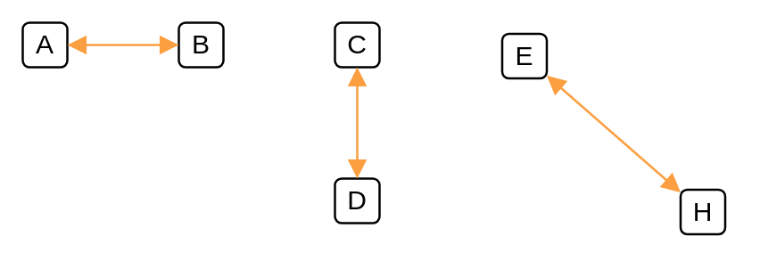

# 10G

## Definition

```
{
  _style: { 
    dependency: 'endArrow=block;html=1;startArrow=block;startFill=1;endFill=1;strokeColor=#FB9F41;',
  },
}
```

## Usage

```
import { Component10g } from '@dinghy/standard-components-diagrams/cumulus'

<Component10g/>
```

## Preview


