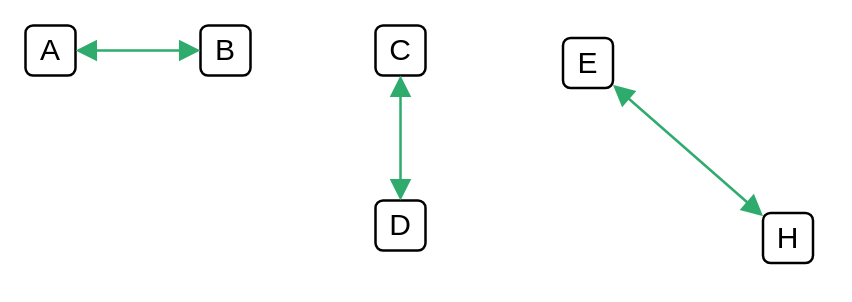
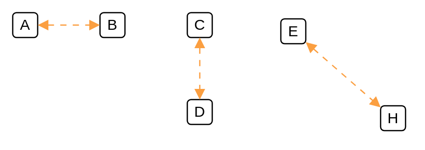
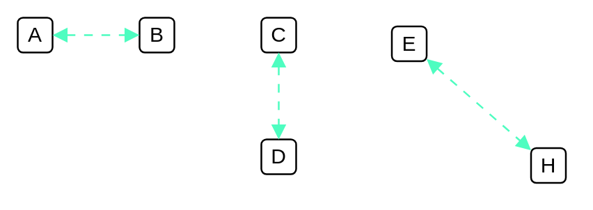

# Networking Cumulus Dependencies

- [Component100g](./component-100g.md)  

- [Component10g](./component-10g.md)  

- [Component1g](./component-1g.md)  

- [Component25g](./component-25g.md)  

- [Component40g](./component-40g.md)  

- [OobRmp](./oob-rmp.md)  

- [Unspecified](./unspecified.md)  

- [Virtual](./virtual.md)  

- [Virtual2](./virtual-2.md)  

- [Virtual3](./virtual-3.md)  

- [Virtual4](./virtual-4.md)  

- [Virtual5](./virtual-5.md)  

- [Virtual6](./virtual-6.md)  

