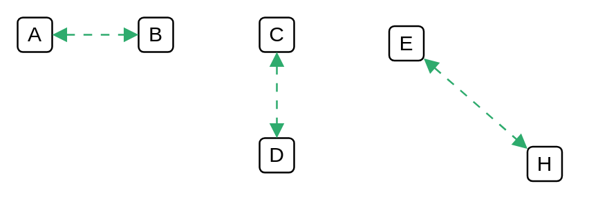

# Virtual 5

## Definition

```
{
  _style: { 
    dependency: 'endArrow=block;html=1;startArrow=block;startFill=1;endFill=1;strokeColor=#2EAB6D;dashed=1;dashPattern=5 5;',
  },
}
```

## Usage

```
import { Virtual5 } from '@reactiac/standard-components-diagrams/cumulus'

<Virtual5/>
```

## Preview


