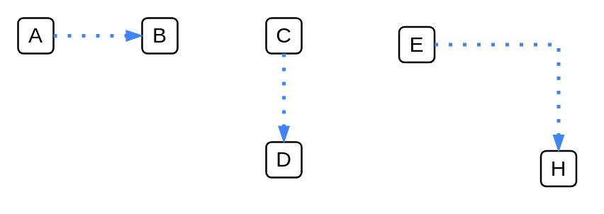

# Optional Primary Path

## Definition

```
{
  _style: { 
    dependency: 'edgeStyle=orthogonalEdgeStyle;fontSize=12;html=1;endArrow=blockThin;endFill=1;rounded=0;strokeWidth=2;endSize=4;startSize=4;dashed=1;dashPattern=1 3;strokeColor=#4284F3;',
  },
}
```

## Usage

```
import { OptionalPrimaryPath } from '@reactiac/standard-components-diagrams/gcp2Paths'

<OptionalPrimaryPath/>
```

## Preview


