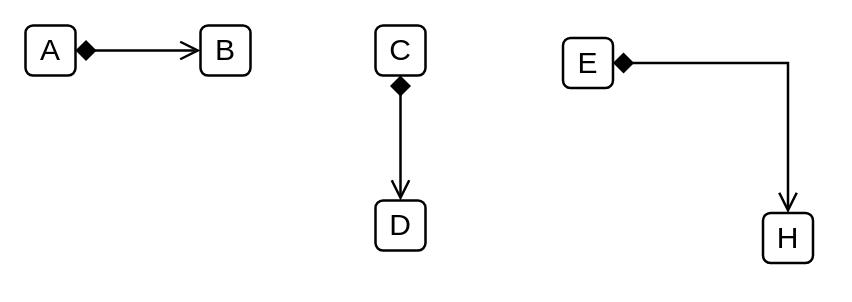

# Composition

## Definition

```
{
  _style: { 
    dependency: 'html=1;labelBackgroundColor=#ffffff;jettySize=auto;orthogonalLoop=1;fontSize=14;rounded=0;jumpStyle=gap;edgeStyle=orthogonalEdgeStyle;startArrow=diamond;startFill=1;endArrow=open;strokeWidth=1;',
  },
}
```

## Usage

```
import { Composition } from '@reactiac/standard-components-diagrams/ibmCloudConnectors'

<Composition/>
```

## Preview


