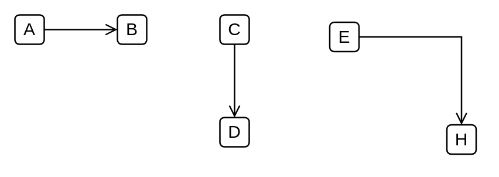
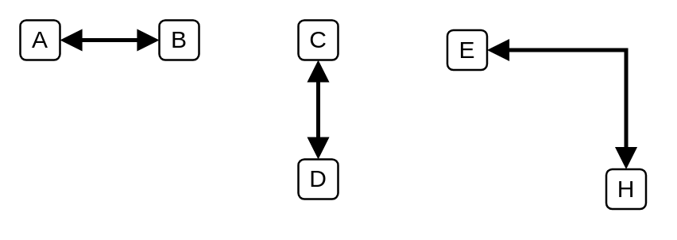
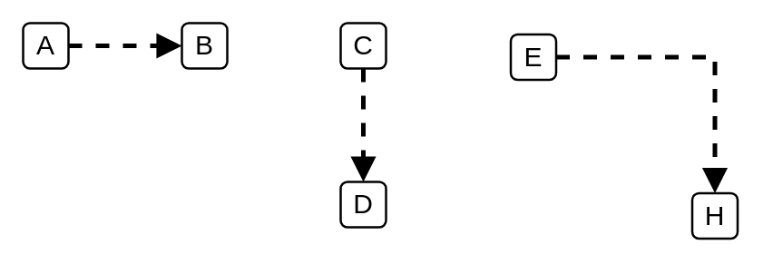
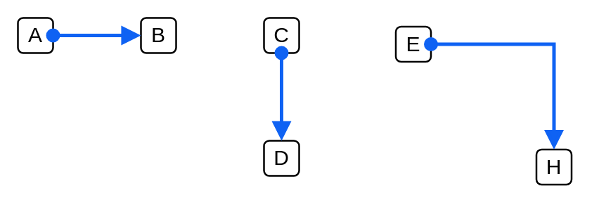
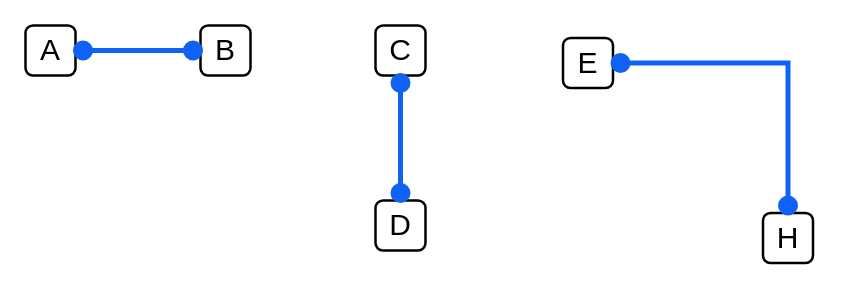
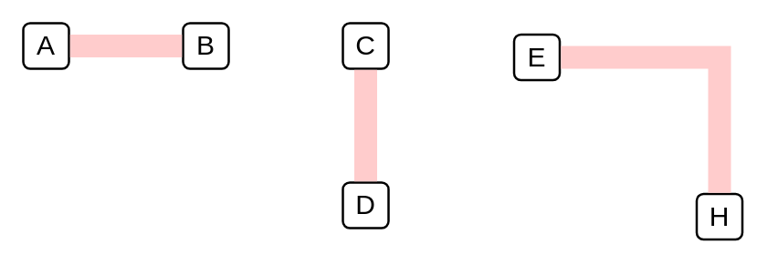

# Ibm Connectors Dependencies

- [Aggregation](./aggregation.md)  

- [Association](./association.md)  

- [Composition](./composition.md)  

- [Connector](./connector.md)  

- [ConnectorArrowArrow](./connector-arrow-arrow.md)  

- [ConnectorArrow](./connector-arrow.md)  

- [ConnectorCircleArrow](./connector-circle-arrow.md)  

- [ConnectorCircleCircle](./connector-circle-circle.md)  

- [DependencyRelationship](./dependency-relationship.md)  

- [Extends](./extends.md)  

- [Implementation](./implementation.md)  

- [LogicalConnector](./logical-connector.md)  

- [LogicalConnectorArrowArrow](./logical-connector-arrow-arrow.md)  

- [LogicalConnectorArrow](./logical-connector-arrow.md)  

- [LogicalConnectorCircleArrow](./logical-connector-circle-arrow.md)  

- [LogicalConnectorCircleCircle](./logical-connector-circle-circle.md)  

- [PhysicalConnector](./physical-connector.md)  

- [PrivateConnectorCircleArrow](./private-connector-circle-arrow.md)  

- [PrivateConnectorCircleCircle](./private-connector-circle-circle.md)  

- [PublicConnectorCircleArrow](./public-connector-circle-arrow.md)  

- [PublicConnectorCircleCircle](./public-connector-circle-circle.md)  

- [TunnelConnector](./tunnel-connector.md)  

