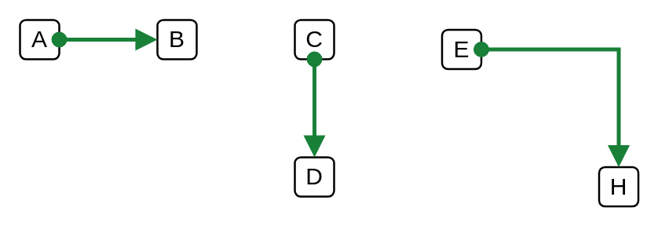

# Private Connector (Circle, Arrow)

## Definition

```
{
  _style: { 
    dependency: 'html=1;labelBackgroundColor=#ffffff;jettySize=auto;orthogonalLoop=1;fontSize=14;rounded=0;jumpStyle=gap;edgeStyle=orthogonalEdgeStyle;startArrow=oval;endArrow=block;strokeWidth=2;startFill=1;endFill=1;strokeColor=#198038;',
  },
}
```

## Usage

```
import { PrivateConnectorCircleArrow } from '@diac/standard-components-diagrams/ibmCloudConnectors'

<PrivateConnectorCircleArrow/>
```

## Preview


