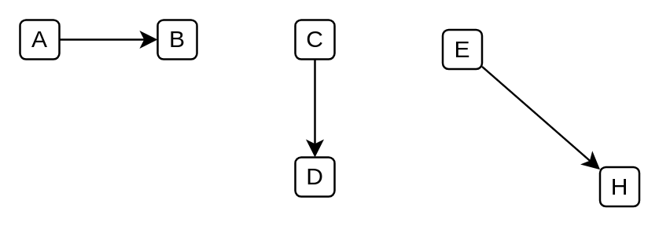

# Connector (Single Arrow)

## Definition

```
{
  _style: { 
    dependency: 'html=1;labelBackgroundColor=#ffffff;endArrow=classic;endFill=1;endSize=6;jettySize=auto;orthogonalLoop=1;strokeWidth=1;fontSize=14;',
  },
}
```

## Usage

```
import { ConnectorSingleArrow } from '@diac/standard-components-diagrams/ibmConnectors'

<ConnectorSingleArrow/>
```

## Preview


