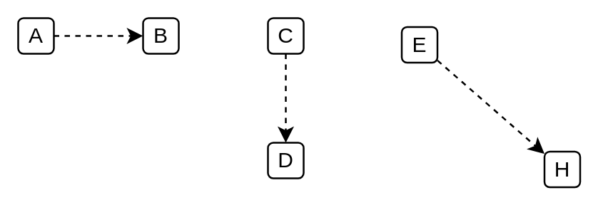

# Dashed Connector (Single Arrow)

## Definition

```
{
  _style: { 
    dependency: 'html=1;labelBackgroundColor=#ffffff;startArrow=none;startFill=0;startSize=6;endArrow=classic;endFill=1;endSize=6;jettySize=auto;orthogonalLoop=1;strokeWidth=1;dashed=1;fontSize=14;',
  },
}
```

## Usage

```
import { DashedConnectorSingleArrow } from '@diac/standard-components-diagrams/ibmConnectors'

<DashedConnectorSingleArrow/>
```

## Preview


