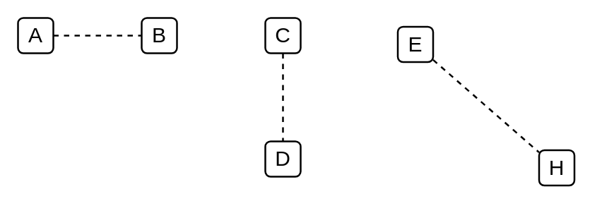

# Dashed Connector

## Definition

```
{
  _style: { 
    dependency: 'html=1;labelBackgroundColor=#ffffff;endArrow=none;endFill=0;jettySize=auto;orthogonalLoop=1;strokeWidth=1;dashed=1;fontSize=14;',
  },
}
```

## Usage

```
import { DashedConnector } from '@reactiac/standard-components-diagrams/ibmConnectors'

<DashedConnector/>
```

## Preview


