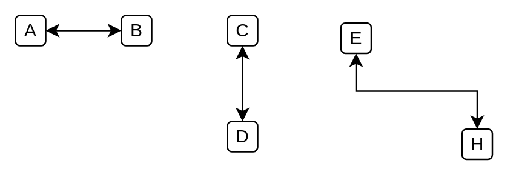

# Elbow Connector (Double Arrow)

## Definition

```
{
  _style: { 
    dependency: 'edgeStyle=elbowEdgeStyle;rounded=0;elbow=vertical;html=1;labelBackgroundColor=#ffffff;startArrow=classic;startFill=1;startSize=6;endArrow=classic;endFill=1;endSize=6;jettySize=auto;orthogonalLoop=1;strokeWidth=1;fontSize=14;',
  },
}
```

## Usage

```
import { ElbowConnectorDoubleArrow } from '@dinghy/standard-components-diagrams/ibmConnectors'

<ElbowConnectorDoubleArrow/>
```

## Preview


