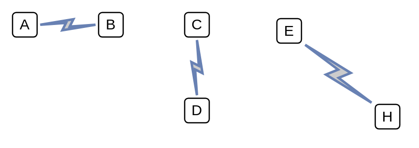

# Comm Link

## Definition

```
{
  _style: { 
    dependency: 'html=1;outlineConnect=0;fillColor=#CCCCCC;strokeColor=#6881B3;gradientColor=none;gradientDirection=north;strokeWidth=2;shape=mxgraph.networks.comm_link_edge;html=1;',
  },
}
```

## Usage

```
import { CommLink } from '@dinghy/standard-components-diagrams/network'

<CommLink/>
```

## Preview


