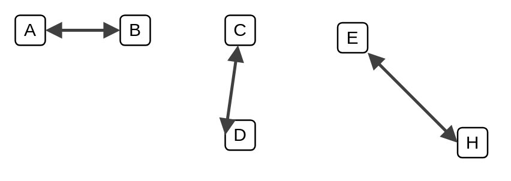

# Connector (grey 3)

## Definition

```
{
  _style: { 
    dependency: 'edgeStyle=none;rounded=0;html=1;entryX=0;entryY=0.5;jettySize=auto;orthogonalLoop=1;strokeColor=#404040;strokeWidth=2;fontColor=#000000;jumpStyle=none;endArrow=block;endFill=1;startArrow=block;startFill=1;',
  },
}
```

## Usage

```
import { ConnectorGrey3 } from '@diac/standard-components-diagrams/veeam2Auxiliary'

<ConnectorGrey3/>
```

## Preview


