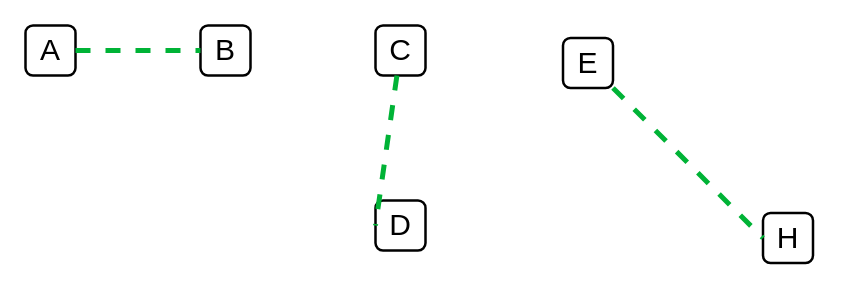

# Dotted line (topaz)

## Definition

```
{
  _style: { 
    dependency: 'edgeStyle=none;rounded=0;html=1;entryX=0;entryY=0.5;jettySize=auto;orthogonalLoop=1;strokeColor=#00B336;strokeWidth=2;fontColor=#000000;jumpStyle=none;endArrow=none;endFill=0;startArrow=none;dashed=1;',
  },
}
```

## Usage

```
import { DottedLineTopaz } from '@dinghy/standard-components-diagrams/veeam2Auxiliary'

<DottedLineTopaz/>
```

## Preview


