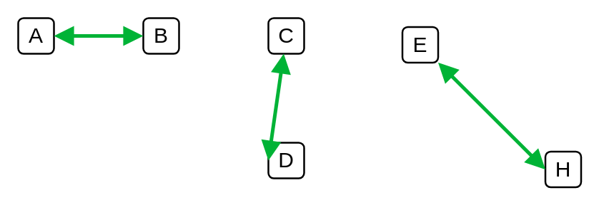
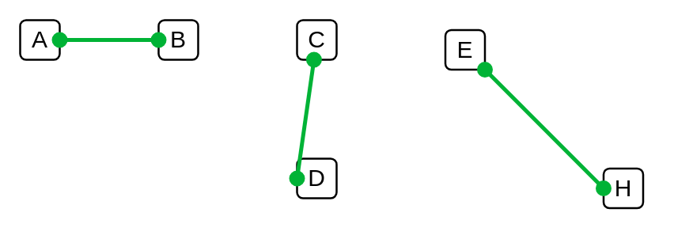
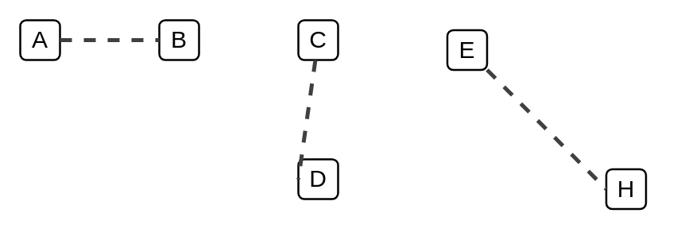

# Veeam2 Auxiliary Dependencies

- [ArrowGrey3](./arrow-grey-3.md)  

- [ArrowTopaz](./arrow-topaz.md)  

- [ConnectorGrey2](./connector-grey-2.md)  

- [ConnectorGrey3](./connector-grey-3.md)  

- [ConnectorTopaz](./connector-topaz.md)  

- [Connector2Topaz](./connector-2-topaz.md)  

- [DottedLineGrey3](./dotted-line-grey-3.md)  

- [DottedLineTopaz](./dotted-line-topaz.md)  

