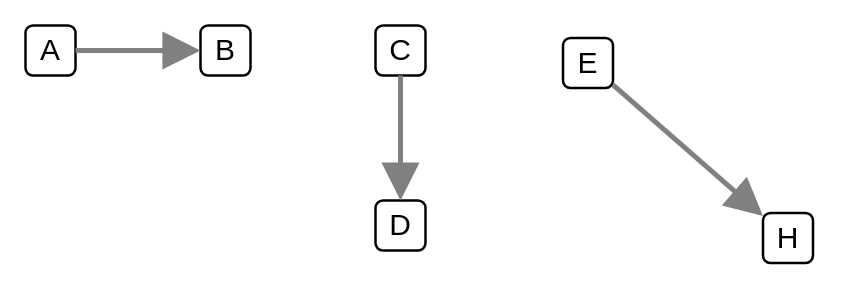

# Point to Point Channel

## Definition

```
{
  _style: { 
    dependency: 'edgeStyle=none;html=1;strokeColor=#808080;endArrow=block;endSize=10;dashed=0;verticalAlign=bottom;strokeWidth=2;',
  },
}
```

## Usage

```
import { PointToPointChannel } from '@dinghy/standard-components-diagrams/eipMessagingChannels'

<PointToPointChannel/>
```

## Preview


