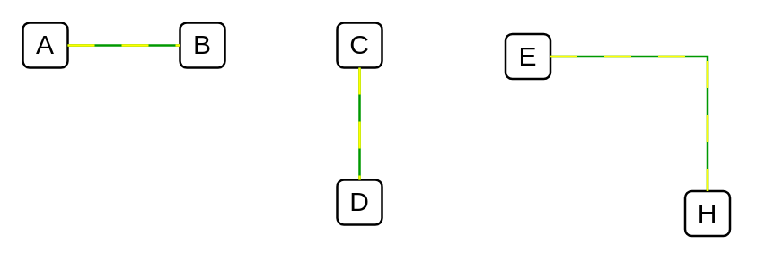

# Dashed Wire

## Definition

```
{
  _style: { 
    dependency: 'shape=wire;edgeStyle=orthogonalEdgeStyle;orthogonalLoop=1;jettySize=auto;html=1;sourcePerimeterSpacing=0;targetPerimeterSpacing=0;endArrow=none;curved=0;rounded=0;strokeColor=#009900;dashed=1;fillColor=#ffff00;dashPattern=12 12;fixDash=1;startSize=6;endSize=6;',
  },
}
```

## Usage

```
import { DashedWire } from '@reactiac/standard-components-diagrams/electricalTransmissionPaths'

<DashedWire/>
```

## Preview


