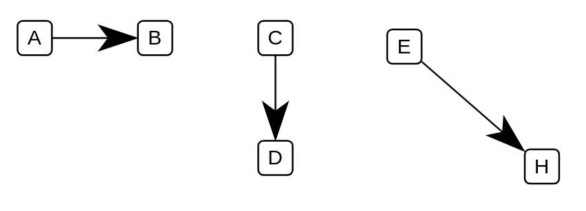

# Direction of Flow

## Definition

```
{
  _style: { 
    dependency: 'endArrow=classicThin;html=1;strokeWidth=1;endSize=20;',
  },
}
```

## Usage

```
import { DirectionOfFlow } from '@reactiac/standard-components-diagrams/electricalTransmissionPaths'

<DirectionOfFlow/>
```

## Preview


