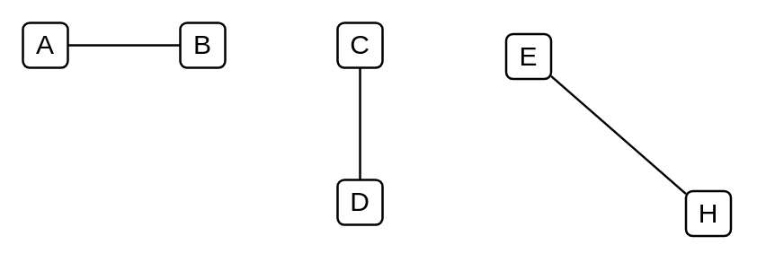

# Transmission Path

## Definition

```
{
  _style: { 
    dependency: 'endArrow=none;html=1;strokeWidth=1;',
  },
}
```

## Usage

```
import { TransmissionPath } from '@diac/standard-components-diagrams/electricalTransmissionPaths'

<TransmissionPath/>
```

## Preview


