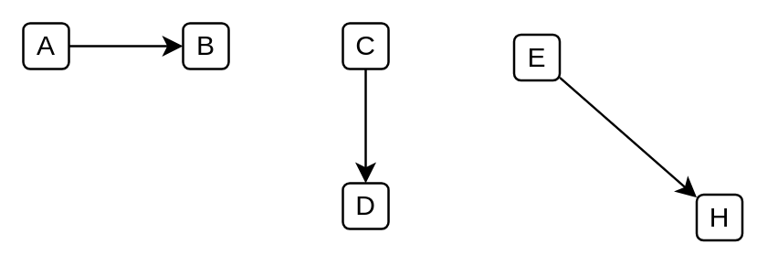

# Data Flow

## Definition

```
{
  _style: { 
    dependency: 'endArrow=classic;html=1;fontColor=#FF3333;',
  },
}
```

## Usage

```
import { DataFlow } from '@dinghy/standard-components-diagrams/threatModeling'

<DataFlow/>
```

## Preview


