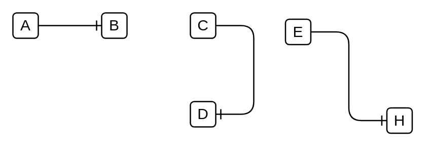

# 1

## Definition

```
{
  _style: { 
    dependency: 'edgeStyle=entityRelationEdgeStyle;fontSize=12;html=1;endArrow=ERone;endFill=1;',
  },
}
```

## Usage

```
import { Component1 } from '@diac/standard-components-diagrams/entityRelation'

<Component1/>
```

## Preview


