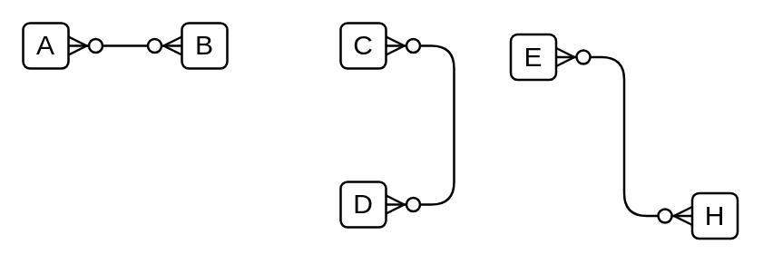

# Many Optional to Many Optional

## Definition

```
{
  _style: { 
    dependency: 'edgeStyle=entityRelationEdgeStyle;fontSize=12;html=1;endArrow=ERzeroToMany;endFill=1;startArrow=ERzeroToMany;',
  },
}
```

## Usage

```
import { ManyOptionalToManyOptional } from '@reactiac/standard-components-diagrams/entityRelation'

<ManyOptionalToManyOptional/>
```

## Preview


