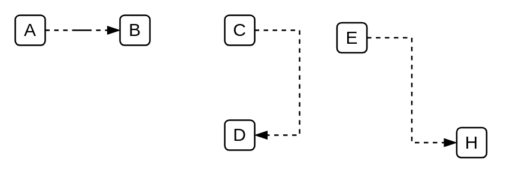

# Default Relationship Connector 4

## Definition

```
{
  _style: { 
    dependency: 'edgeStyle=entityRelationEdgeStyle;fontSize=12;html=1;endArrow=blockThin;endFill=1;startArrow=none;rounded=0;startFill=0;dashed=1;',
  },
}
```

## Usage

```
import { DefaultRelationshipConnector4 } from '@dinghy/standard-components-diagrams/salesforceComponents'

<DefaultRelationshipConnector4/>
```

## Preview


