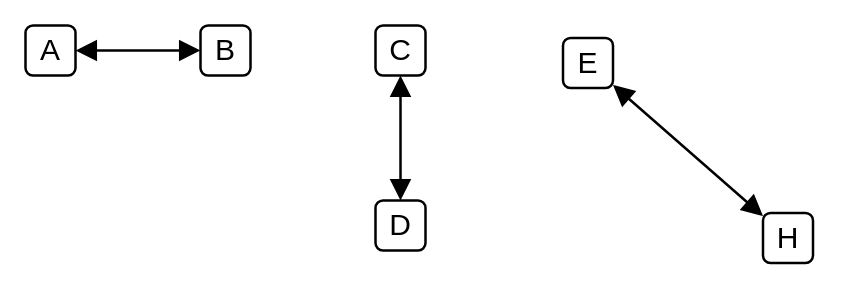

# Association 2

## Definition

```
{
  _style: { 
    dependency: 'endArrow=block;startArrow=block;endFill=1;startFill=1;html=1;',
  },
}
```

## Usage

```
import { Association2 } from '@diac/standard-components-diagrams/uml'

<Association2/>
```

## Preview


