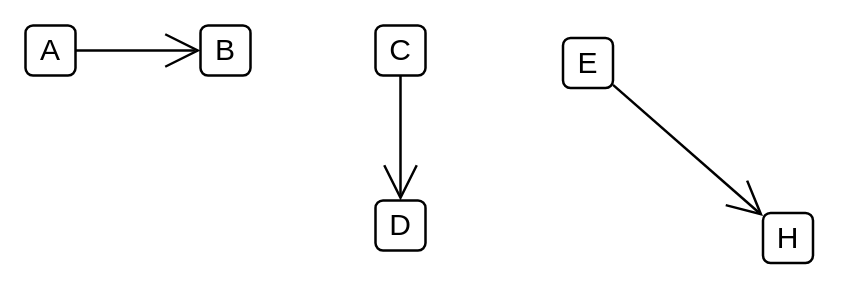

# Association 3

## Definition

```
{
  _style: { 
    dependency: 'endArrow=open;endFill=1;endSize=12;html=1;',
  },
}
```

## Usage

```
import { Association3 } from '@diac/standard-components-diagrams/uml'

<Association3/>
```

## Preview


