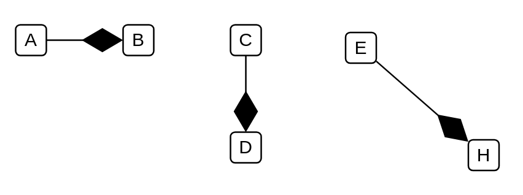

# Composition 2

## Definition

```
{
  _style: { 
    dependency: 'endArrow=diamondThin;endFill=1;endSize=24;html=1;',
  },
}
```

## Usage

```
import { Composition2 } from '@diac/standard-components-diagrams/uml'

<Composition2/>
```

## Preview


