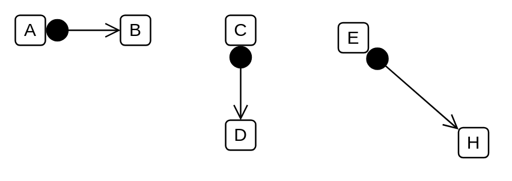

# Found Message 2

## Definition

```
{
  _style: { 
    dependency: 'html=1;verticalAlign=bottom;startArrow=circle;startFill=1;endArrow=open;startSize=6;endSize=8;curved=0;rounded=0;',
  },
}
```

## Usage

```
import { FoundMessage2 } from '@diac/standard-components-diagrams/uml'

<FoundMessage2/>
```

## Preview


