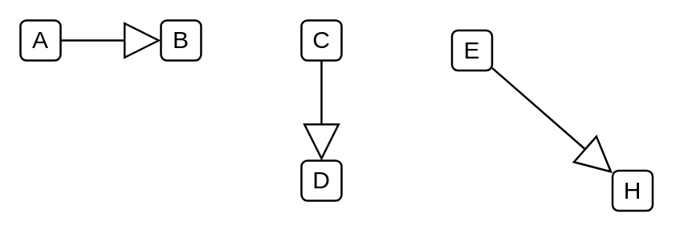
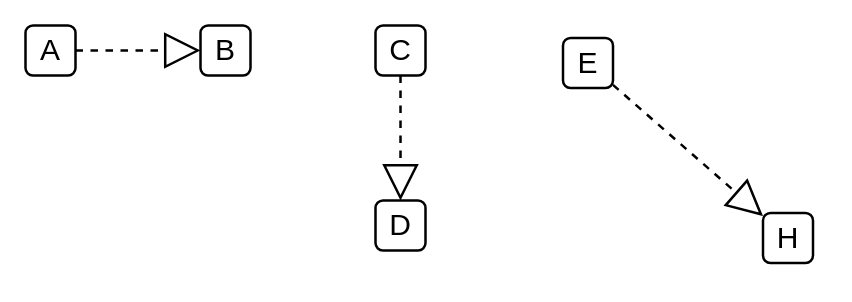

# Uml UML Dependencies

- [Aggregation2](./aggregation-2.md)  

- [Association2](./association-2.md)  

- [Association3](./association-3.md)  

- [Composition2](./composition-2.md)  

- [DependencyRelationship](./dependency-relationship.md)  

- [FoundMessage1](./found-message-1.md)  

- [FoundMessage2](./found-message-2.md)  

- [Generalization](./generalization.md)  

- [Implementation](./implementation.md)  

- [InnerClass](./inner-class.md)  

- [Message](./message.md)  

- [Terminate](./terminate.md)  

