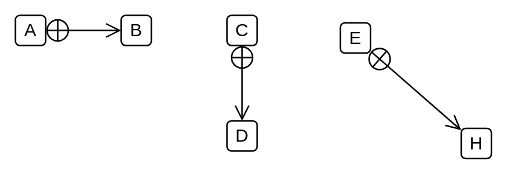

# Inner Class

## Definition

```
{
  _style: { 
    dependency: 'endArrow=open;startArrow=circlePlus;endFill=0;startFill=0;endSize=8;html=1;',
  },
}
```

## Usage

```
import { InnerClass } from '@reactiac/standard-components-diagrams/uml'

<InnerClass/>
```

## Preview


